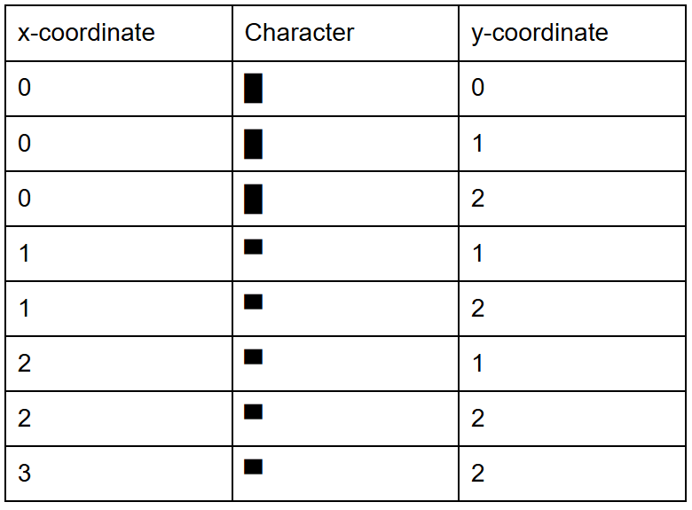
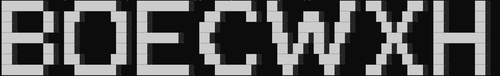

# Print-2d-Grid
Given a URL that includes a table with x and y coordinators and characters, I will print them out for you.

[Example URL](https://docs.google.com/document/d/e/2PACX-1vQGUck9HIFCyezsrBSnmENk5ieJuYwpt7YHYEzeNJkIb9OSDdx-ov2nRNReKQyey-cwJOoEKUhLmN9z/pub)
Table Format:

Output: 

